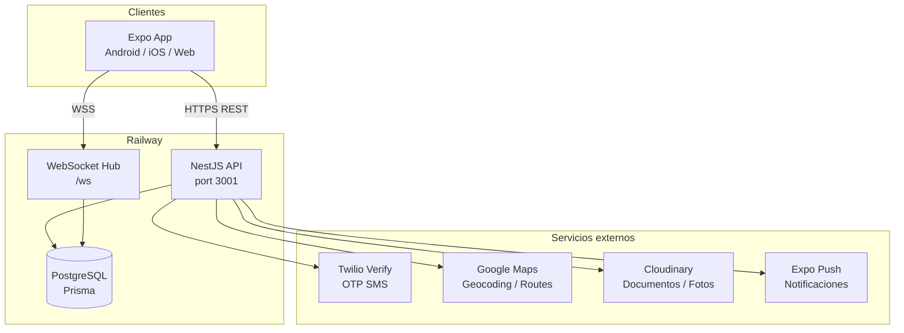

# MOVI — Arquitectura técnica

## Vista general

MOVI es un monorepo con frontend Expo (React Native + Web) y backend NestJS en el mismo repositorio. La app móvil y el dashboard admin comparten componentes, servicios API y tipos TypeScript.



---

## Frontend — capas

### Navegación (Expo Router)

Rutas file-based en `app/`:

| Grupo | Rutas | Rol |
|-------|-------|-----|
| `app/auth/` | Login, registro, OTP, forgot password | Todos |
| `app/passenger/` | Home, solicitar viaje, historial | `passenger` |
| `app/driver/` | Sesión, ofertas, viaje activo | `driver` |
| `app/owner/` | Flota, vehículos, invitaciones | `owner` |
| `app/business/` | Pedidos delivery | `business` |
| `app/admin/` | Dashboard completo | `admin` (staff) |
| `app/onboarding/` | Flujos de registro por rol | Nuevos usuarios |

Layout raíz (`app/_layout.tsx`) envuelve con `AuthContext`, `TripContext`, tema MOVI.

### Servicios (`src/services/`)

| Servicio | Responsabilidad |
|----------|-----------------|
| `api/client.ts` | HTTP fetch con JWT, timeout, manejo de errores de red |
| `api/config.ts` | `EXPO_PUBLIC_API_URL`, mock mode |
| `authService.ts` | Sesión AsyncStorage, persist/restore |
| `realtimeClient.ts` | WebSocket para viajes en vivo |
| `mapsService.ts` | Integración maps frontend |
| `pushNotificationService.ts` | Expo push token sync |
| `uploadService.ts` | Upload de documentos |
| `mockApi/` | API in-memory para demo offline |

### Estado

- **AuthContext** — usuario autenticado, rol, logout
- **TripContext** — viaje activo del pasajero/conductor
- **AsyncStorage** — tokens JWT, usuario serializado
- **profileCache** — perfiles owner/driver/business cacheados post-login

### Admin dashboard

Componentes en `src/components/admin/`:

- `AdminShell`, `AdminSidebar` — layout
- `AdminRouteGuard` — guard de permisos frontend
- `operations-live/` — mapa en vivo, alertas, dispatch
- `DashboardSections`, `ExecutiveKpiGrid` — métricas

Permisos frontend mirror del backend en `src/config/adminPermissions.ts`.

---

## Backend — módulos NestJS

```
backend/src/
├── auth/              POST /auth/*
├── passengers/        POST /passengers/register
├── owners/            Owner registro, docs, invitaciones
├── vehicles/          Vehículos, docs, invitar conductor
├── drivers/           Registro con invite, sesiones online
├── businesses/        Registro comercio
├── trips/             Ciclo completo de viajes
├── admin/             Dashboard API (múltiples controllers)
├── analytics/         KPIs y métricas
├── locations/         Geocoding, demand zones, integraciones
├── notifications/     Push tokens, notificaciones in-app
├── chat/              Chat por viaje
├── subscriptions/     Suscripción conductor ($7/mes)
├── uploads/           Upload multipart
├── ratings/           Ratings post-viaje
├── realtime/          TripHubService (WebSocket)
├── health/            GET /health
└── common/
    ├── guards/        JwtAuthGuard, RolesGuard, AdminStaffGuard
    ├── interceptors/  ApiResponseInterceptor
    └── filters/       ApiExceptionFilter
```

### Pipeline de request

1. `ApiExceptionFilter` — errores → `{ ok: false, error, code? }`
2. `JwtAuthGuard` — valida Bearer JWT (excepto rutas públicas)
3. `RolesGuard` — valida `UserRole` del token
4. `AdminStaffGuard` — valida `AdminStaffRole` + permisos granulares
5. Controller → Service → Prisma
6. `ApiResponseInterceptor` — envuelve respuesta en `{ ok: true, data }`

### Servicios de dominio clave

| Servicio | Archivo | Función |
|----------|---------|---------|
| Auth | `auth.service.ts` | Login password, forgot/reset, set password |
| OTP | `otpService.ts` | Twilio Verify / demo OTP |
| Movi core | `moviService.ts` | Registro owners, vehículos, verificación |
| Trips | `tripService.ts` | CRUD viajes, ofertas, lifecycle |
| Admin entities | `admin-entity-actions.service.ts` | CRUD admin passengers/drivers/owners |
| Admin vehicles | `admin-vehicle-actions.service.ts` | Aprobar/rechazar vehículos |
| Permissions | `admin-permissions.service.ts` | Matriz de permisos staff |
| Provider eligibility | `providerEligibility.service.ts` | Matching conductor-viaje por radio/tipo |
| Operations live | `operations-live.service.ts` | Snapshot operaciones en tiempo real |
| Dispatch | `dispatch.service.ts` | Asignación manual de conductores |
| Audit | `audit.service.ts` | Audit logs |
| Ensure super admin | `ensure-super-admin.service.ts` | Bootstrap SUPER_ADMIN en startup |

---

## Realtime (WebSocket)

- Path: `/ws`
- Implementación: `TripHubService` (Socket.IO sobre HTTP server)
- Eventos: actualizaciones de viaje, ofertas, ubicación conductor, chat
- Frontend: `realtimeClient.ts` conecta post-autenticación

---

## Storage de documentos

Provider resuelto por env (`STORAGE_PROVIDER`):

| Modo | Cuándo |
|------|--------|
| `cloudinary` | Producción (credenciales Cloudinary presentes) |
| `s3` | Alternativa AWS S3 |
| `local` | Dev — archivos en `backend/uploads/`, servidos en `/uploads` |

Upload vía `POST /uploads` (multipart) o endpoints específicos de documentos por entidad.

---

## Matching de viajes

`providerEligibility.service.ts`:

1. Conductor debe estar `approved`, vehículo `approved`, suscripción activa
2. Para viajes `NOW`: conductor debe tener sesión activa (`DriverSession` sin `disconnectedAt`)
3. Radio de cobertura por tipo de vehículo (mototaxi: 5km, camión: 20km, etc.)
4. Compatibilidad de tipos de vehículo (matriz `VEHICLE_COMPATIBILITY`)
5. Viajes `SCHEDULED`: solo microbus, pickup, camión

---

## Verificación de vehículos

Flujo en `moviService.submitVehicleVerification()`:

1. Owner sube documentos (`documentsJson`, `registrationCard`)
2. Al enviar: valida documentos críticos presentes
3. Compara `registrationName` vs `owner.name` con `namesMatch()` (comparación exacta normalizada)
4. Si falla → status `incomplete` (no `rejected`) con `rejectReason`
5. Si OK → status `under_review` para revisión admin

**Nota:** El bug #3 (vehículos auto-rechazados) puede deberse a datos legacy con status `rejected` o comparación estricta de nombres — ver `MOVI_OPEN_BUGS.md`.

---

## Seguridad

| Mecanismo | Implementación |
|-----------|----------------|
| JWT access | 1h TTL, `JWT_SECRET` |
| Refresh tokens | Hash en DB, rotación en `/auth/refresh` |
| Login lockout | 15 min tras intentos fallidos (`login-lockout.service.ts`) |
| Password hash | bcryptjs, mín 8 chars + letra + número |
| Admin OTP + DUI | Segundo factor para staff |
| Audit logs | Todas las acciones admin sensibles |
| CORS | `CORS_ORIGIN` env |

---

## QA y CI

Scripts en `backend/package.json`:

- `npm run qa:auth` — flujo auth completo
- `npm run qa:owner-login` — login owner específico (+50370328885)
- `npm run qa:admin-entities` — CRUD admin entities
- `npm run qa:beta-final` — suite beta
- `npm run test:ci` — gate CI (`ci-qa-gate.ts`)

Ejecutar desde raíz: `npm run qa:auth` (delega a backend).

---

## Decisiones arquitectónicas

1. **Monorepo** — frontend y backend en un repo para sincronizar tipos y deploy coordinado.
2. **Prisma single schema** — un `schema.prisma` PostgreSQL-only en producción.
3. **Admin en la misma app Expo** — dashboard web responsive, no SPA separada.
4. **Mock API mode** — `EXPO_PUBLIC_USE_MOCK_API=true` para demos sin backend.
5. **Soft delete** — owners/vehicles/drivers usan `deletedAt` + status `deleted`, no hard delete.
6. **Super admin bootstrap** — `ensureSuperAdmin()` en cada startup del backend.
